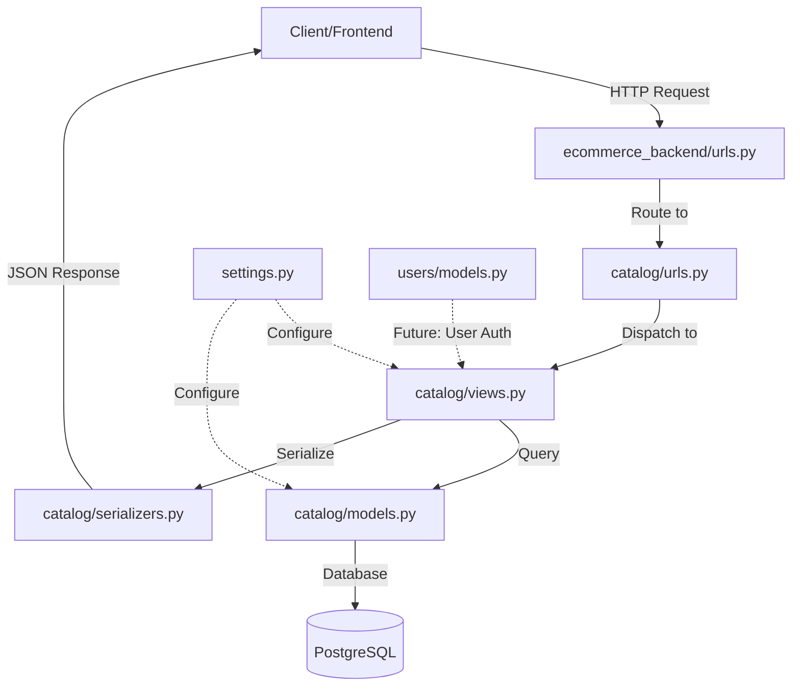

# Django E-commerce Backend - Project Structure Guide

## 📁 High-Level Overview

```
alx-project-nexus-be/
├── ecommerce_backend/          # 🏠 Django Project Root
│   ├── ecommerce_backend/      # ⚙️ Project Configuration Package
│   ├── users/                  # 👤 User Authentication App
│   ├── catalog/                # 🛍️ Product Catalog App
│   ├── manage.py               # 🔧 Django CLI Tool
│   └── .env                    # 🔒 Environment Variables
├── venv/                       # 🐍 Python Virtual Environment
├── documentation/              # 📚 Project Documentation
├── requirements.txt            # 📦 Python Dependencies
└── .gitignore                  # 🚫 Git Ignore Rules
```

---

## 🏗️ Detailed Structure Breakdown

### 1️⃣ **`./ecommerce_backend/`** - Django Project Root

**Type:** Directory (Project Container)

**Purpose:** The main container for your entire Django project. This is where Django lives.

**Contains:**
- `manage.py` - Django's command-line utility
- `.env` - Environment variables (secrets, database config)
- Django apps (users, catalog, etc.)
- Project configuration package

**Key Files:**
```
ecommerce_backend/
├── manage.py              # CLI tool for Django commands
└── .env                   # SECRET_KEY, DATABASE_URL, DEBUG
```

**Common Commands Run Here:**
```bash
python manage.py runserver          # Start dev server
python manage.py makemigrations     # Create migrations
python manage.py migrate            # Apply migrations
python manage.py createsuperuser    # Create admin user
python manage.py shell              # Django Python shell
```

---

### 2️⃣ **`./ecommerce_backend/ecommerce_backend/`** - Project Configuration Package

**Type:** Django Project Package (Configuration Hub)

**Purpose:** The **brain** of your Django project. Contains all global settings, URL routing, and WSGI/ASGI configuration.

**Structure:**
```
ecommerce_backend/ecommerce_backend/
├── __init__.py           # Makes this a Python package
├── settings.py           # 🎛️ Global project settings
├── urls.py               # 🛣️ Main URL routing
├── wsgi.py               # 🌐 WSGI server entry point
└── asgi.py               # ⚡ ASGI server entry point (async)
```

#### **Key Files Explained:**

##### **`settings.py`** - The Control Center
**What it does:**
- Configures database connection (PostgreSQL)
- Registers installed apps (users, catalog, REST framework)
- Security settings (SECRET_KEY, DEBUG, ALLOWED_HOSTS)
- Middleware configuration
- Authentication settings (custom user model)
- Static files configuration

**Key Settings:**
```python
# Database
DATABASES = {'default': env.db()}  # PostgreSQL via .env

# Custom User Model
AUTH_USER_MODEL = 'users.CustomUser'  # Email-based auth

# Installed Apps
INSTALLED_APPS = [
    'django.contrib.admin',
    'rest_framework',           # API framework
    'rest_framework_simplejwt', # JWT authentication
    'users.apps.UsersConfig',   # Custom user app
    'catalog',                  # Product catalog
]
```

##### **`urls.py`** - The Router
**What it does:**
- Maps URLs to views
- Routes requests to appropriate apps

**Current Configuration:**
```python
urlpatterns = [
    path('admin/', admin.site.urls),              # Django admin
    path('api/catalog/', include('catalog.urls')), # Catalog API
]
```

**URL Structure:**
```
http://localhost:8000/admin/                    → Django Admin
http://localhost:8000/api/catalog/categories/   → Catalog API
http://localhost:8000/api/catalog/products/     → Products API
```

##### **`wsgi.py` & `asgi.py`** - Server Entry Points
- **WSGI**: Traditional synchronous server (Gunicorn, uWSGI)
- **ASGI**: Asynchronous server (Daphne, Uvicorn) - for WebSockets, async views

---

### 3️⃣ **`./ecommerce_backend/users/`** - User Authentication App

**Type:** Django App (Authentication & User Management)

**Purpose:** Handles everything related to **user accounts, authentication, and authorization**.

**Structure:**
```
users/
├── __init__.py
├── models.py              # 👤 CustomUser model
├── admin.py               # Admin interface config
├── apps.py                # App configuration
├── views.py               # User-related views (future)
├── serializers.py         # API serializers (future)
├── urls.py                # User endpoints (future)
├── migrations/            # Database migrations
│   └── 0001_initial.py   # Initial user table creation
└── tests.py               # Unit tests
```

#### **Key Components:**

##### **`models.py`** - CustomUser Model
**What it defines:**
```python
class CustomUser(AbstractUser):
    id = models.UUIDField(primary_key=True, default=uuid4)  # UUID instead of int
    email = models.EmailField(unique=True)                   # Email as username
    username = models.CharField(null=True, blank=True)       # Optional username
    
    USERNAME_FIELD = 'email'  # Login with email
    REQUIRED_FIELDS = ['first_name', 'last_name']
```

**Features:**
- ✅ Email-based authentication (modern approach)
- ✅ UUID primary keys (security best practice)
- ✅ Custom user manager for creating users/superusers
- ✅ Inherits Django's built-in user fields (password, is_staff, etc.)

**Database Table:** `users_customuser`

**Why it exists:**
- Default Django user uses username - we want email
- UUIDs are more secure than sequential IDs
- Foundation for JWT authentication
- Supports cart ownership, order tracking, wishlists

**Future Additions:**
- User registration API endpoint
- Login/logout endpoints
- Password reset functionality
- User profile management
- JWT token generation

---

### 4️⃣ **`./ecommerce_backend/catalog/`** - Product Catalog App

**Type:** Django App (Product & Category Management)

**Purpose:** Manages all **product data, categories, inventory, and pricing**.

**Structure:**
```
catalog/
├── __init__.py
├── models.py              # 📦 Product & Category models
├── serializers.py         # 🔄 API serializers
├── views.py               # 🎯 API views
├── urls.py                # 🛣️ Catalog endpoints
├── admin.py               # 🎛️ Admin interface
├── apps.py                # App configuration
├── migrations/            # Database migrations
├── tests.py               # Unit tests
└── README.md              # App documentation
```

#### **Key Components:**

##### **`models.py`** - Data Models
**Defines two models:**

1. **Category Model:**
```python
class Category(models.Model):
    id = models.UUIDField(primary_key=True, default=uuid4)
    name = models.CharField(max_length=100)
    slug = models.SlugField(unique=True)  # URL-friendly name
```

**Example Data:**
| ID (UUID) | Name | Slug |
|-----------|------|------|
| abc-123... | Electronics | electronics |
| def-456... | Clothing | clothing |

2. **Product Model:**
```python
class Product(models.Model):
    id = models.UUIDField(primary_key=True, default=uuid4)
    category = models.ForeignKey(Category, on_delete=models.SET_NULL)
    name = models.CharField(max_length=100)
    description = models.TextField()
    base_price = models.DecimalField(max_digits=10, decimal_places=2)
    discount_percentage = models.DecimalField(max_digits=5, decimal_places=2)
    stock_quantity = models.IntegerField()
    is_available = models.BooleanField(default=True)
    is_featured = models.BooleanField(default=False)
    
    @property
    def sale_price(self):
        # Calculates price after discount
        return self.base_price - (self.base_price * self.discount_percentage / 100)
```

**Database Tables:**
- `catalog_category`
- `catalog_product`

##### **`serializers.py`** - API Data Transformation
**Converts models to JSON:**

```python
class ProductSerializer(serializers.ModelSerializer):
    sale_price = serializers.DecimalField(read_only=True)  # Calculated field
    category = CategorySerializer(read_only=True)          # Nested data
    
    class Meta:
        model = Product
        fields = ['id', 'name', 'base_price', 'sale_price', 'category', ...]
        read_only_fields = ['id', 'created_at', 'sale_price']  # Security
```

**API Response Example:**
```json
{
  "id": "abc-123-uuid",
  "name": "Laptop",
  "category": {
    "id": "cat-uuid",
    "name": "Electronics",
    "slug": "electronics"
  },
  "base_price": "999.99",
  "sale_price": "899.99",
  "discount_percentage": "10.00",
  "stock_quantity": 50,
  "is_available": true
}
```

##### **`views.py`** - API Endpoints
**Defines API views:**

```python
class CategoryListView(generics.ListAPIView):
    queryset = Category.objects.all()
    serializer_class = CategorySerializer

class ProductListCreateView(generics.ListCreateAPIView):
    serializer_class = ProductSerializer
    
    def get_queryset(self):
        # Only show available products
        queryset = Product.objects.filter(is_available=True)
        
        # Optional category filter
        category_slug = self.request.query_params.get('category')
        if category_slug:
            queryset = queryset.filter(category__slug=category_slug)
        
        return queryset
```

##### **`urls.py`** - URL Routing
```python
urlpatterns = [
    path('categories/', CategoryListView.as_view(), name='category-list'),
    path('products/', ProductListCreateView.as_view(), name='product-list-create'),
]
```

**Available Endpoints:**
- `GET /api/catalog/categories/` - List all categories
- `GET /api/catalog/products/` - List available products
- `GET /api/catalog/products/?category=electronics` - Filter by category
- `POST /api/catalog/products/` - Create new product

##### **`admin.py`** - Django Admin Interface
**Customizes admin panel:**
```python
@admin.register(Product)
class ProductAdmin(admin.ModelAdmin):
    list_display = ['name', 'category', 'base_price', 'stock_quantity', 'is_available']
    list_filter = ['category', 'is_available', 'is_featured']
    list_editable = ['base_price', 'stock_quantity', 'is_available']
    search_fields = ['name', 'description']
```

**Admin Features:**
- ✅ Bulk edit products
- ✅ Filter by category/availability
- ✅ Search products
- ✅ Quick price/stock updates

---

## 🔄 How Apps Interact



---

## 📊 App Responsibilities Summary

| App | Responsibility | Key Models | API Endpoints |
|-----|---------------|------------|---------------|
| **ecommerce_backend/** | Project configuration | None | None |
| **users/** | Authentication & user management | CustomUser | (Future: /api/auth/*) |
| **catalog/** | Products & categories | Category, Product | /api/catalog/* |
| **(Future) cart/** | Shopping cart | CartItem | /api/cart/* |
| **(Future) orders/** | Order processing | Order, OrderItem | /api/orders/* |

---

## 🎯 Current Project Status

### ✅ Implemented:
- ✅ Custom user model with email authentication
- ✅ Product catalog with categories
- ✅ REST API for products/categories
- ✅ Django admin interface
- ✅ PostgreSQL database
- ✅ Environment-based configuration

### 🚧 Future Apps (Commented in settings.py):
```python
# 'cart',      # Shopping cart functionality
# 'orders',    # Order processing & checkout
```

---

## 🔑 Key Takeaways

1. **`ecommerce_backend/ecommerce_backend/`** = **Configuration Hub**
   - Settings, URLs, WSGI/ASGI
   - No business logic, just configuration

2. **`users/`** = **Who can access the system**
   - Authentication, authorization
   - User accounts, profiles

3. **`catalog/`** = **What users can buy**
   - Products, categories, inventory
   - Product browsing API

4. **Apps are modular** = Each app has its own:
   - Models (database tables)
   - Views (business logic)
   - URLs (endpoints)
   - Serializers (API data format)
   - Admin (management interface)

---

## 📚 Further Reading

- [Django Project Structure Best Practices](https://docs.djangoproject.com/en/5.2/intro/tutorial01/)
- [Django Apps Documentation](https://docs.djangoproject.com/en/5.2/ref/applications/)
- [REST Framework Views](https://www.django-rest-framework.org/api-guide/views/)
